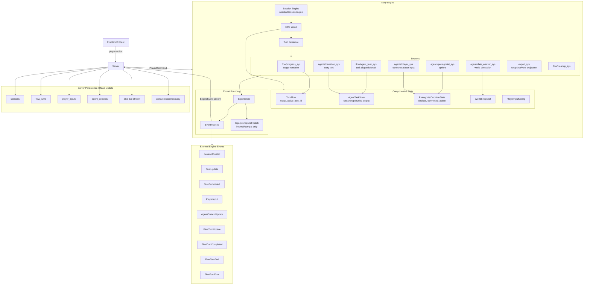
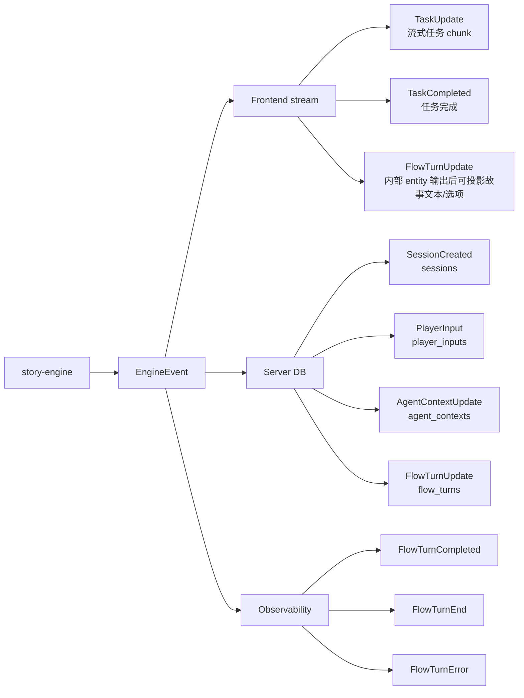

```mermaid
flowchart TB
    Client["Frontend / Client"] -->|player action| Server["Server"]
    Server -->|PlayerCommand| Engine["story-engine"]

    subgraph Engine["story-engine"]
        Session["Session Engine\nAkashicSessionEngine"]
        World["ECS World"]
        Schedule["Turn Schedule"]

        subgraph Components["Components / State"]
            TurnFlow["TurnFlow\nstage, active_turn_id"]
            AgentTask["AgentTaskState\nstreaming chunks, output"]
            Decision["ProtagonistDecisionState\nchoices, committed_action"]
            Snapshot["WorldSnapshot"]
            PlayerCfg["PlayerInputConfig"]
        end

        subgraph Systems["Systems"]
            Progress["flow/progress_sys\nstage transition"]
            TaskSys["flow/agent_task_sys\ntask dispatch/result"]
            Fate["agents/fate_weaver_sys\nworld simulation"]
            Narrator["agents/narration_sys\nstory text"]
            Protagonist["agents/protagonist_sys\noptions"]
            Player["agents/player_sys\nconsume player input"]
            ExportSys["export_sys\nsnapshot/view projection"]
            Cleanup["flow/cleanup_sys"]
        end

        subgraph Export["Export Boundary"]
            ExportState["ExportState"]
            EventPipeline["EventPipeline"]
            SnapshotWatch["legacy snapshot watch\ninternal/compat only"]
        end

        Session --> World
        World --> Components
        World --> Schedule
        Schedule --> Systems

        Progress --> TurnFlow
        TaskSys --> AgentTask
        Fate --> Snapshot
        Narrator --> AgentTask
        Protagonist --> Decision
        Player --> Decision

        Systems --> ExportState
        ExportState --> EventPipeline
        ExportState --> SnapshotWatch
    end

    EventPipeline -->|EngineEvent stream| Server

    subgraph Events["External Engine Events"]
        SessionCreated["SessionCreated"]
        TaskUpdate["TaskUpdate"]
        TaskCompleted["TaskCompleted"]
        PlayerInput["PlayerInput"]
        AgentContextUpdate["AgentContextUpdate"]
        FlowTurnUpdate["FlowTurnUpdate"]
        FlowTurnCompleted["FlowTurnCompleted"]
        FlowTurnEnd["FlowTurnEnd"]
        FlowTurnError["FlowTurnError"]
    end

    EventPipeline --> Events

    subgraph ServerStores["Server Persistence / Read Models"]
        Sessions["sessions"]
        FlowTurns["flow_turns"]
        PlayerInputs["player_inputs"]
        AgentContexts["agent_contexts"]
        SSE["SSE live stream"]
        Archive["archive/export/recovery"]
    end

    Server --> SSE
    Server --> Sessions
    Server --> FlowTurns
    Server --> PlayerInputs
    Server --> AgentContexts
    Server --> Archive
```

```mermaid
flowchart LR
    Engine["story-engine"] --> Events["EngineEvent"]

    Events --> UI["Frontend stream"]
    Events --> DB["Server DB"]
    Events --> Obs["Observability"]

    UI --> TaskUpdate["TaskUpdate\n流式任务 chunk"]
    UI --> TaskCompleted["TaskCompleted\n任务完成"]
    UI --> FlowText["FlowTurnUpdate\n内部 entity 输出后可投影故事文本/选项"]

    DB --> SessionCreated["SessionCreated\nsessions"]
    DB --> PlayerInput["PlayerInput\nplayer_inputs"]
    DB --> AgentContextUpdate["AgentContextUpdate\nagent_contexts"]
    DB --> FlowTurnUpdate["FlowTurnUpdate\nflow_turns"]

    Obs --> FlowTurnCompleted["FlowTurnCompleted"]
    Obs --> FlowTurnEnd["FlowTurnEnd"]
    Obs --> FlowTurnError["FlowTurnError"]
```
